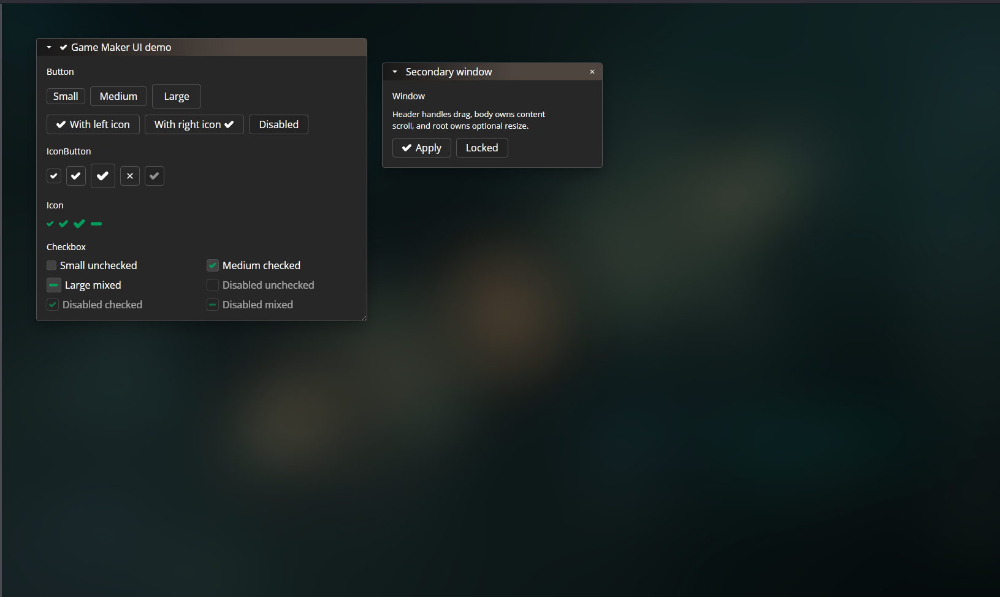

# Game Maker UI

React UI library inspired by GameMaker Studio 2 interface patterns.

[Live demo](https://damirlut.github.io/game-maker-ui/) · [Storybook](https://damirlut.github.io/game-maker-ui/storybook)

> ⚠
> This library is still in active development and is not published to npm yet. The public API, styling, and package contract may change before the first stable release.



## Overview

Game Maker UI is a small component library for building desktop-like, game-tooling interfaces in React. The visual language follows GameMaker Studio 2-style controls: compact buttons, pixel-sharp window chrome, simple icons, tri-state checkboxes, draggable panels, and resizable utility windows.

## Features

- React 18 and React 19 peer dependency support.
- Typed TypeScript component API.
- GameMaker-inspired visual theme.
- Button, IconButton, Icon, Checkbox, and Window components.
- Tri-state checkbox support with `checked="mixed"`.
- Compound `Window` API with `Window.Header` and `Window.Body`.
- Controlled and uncontrolled state support where it matters.
- Separate CSS export for explicit style loading.
- Storybook documentation for visual inspection.

## Installation

The package is not published to npm yet. The commands below describe the intended installation flow after publication:

```bash
npm install game-maker-ui
```

```bash
bun add game-maker-ui
```

React and React DOM are peer dependencies:

```bash
npm install react react-dom
```

## Usage

Import the stylesheet once near your application entrypoint:

```tsx
import "game-maker-ui/styles.css";
```

Then import components from the package root:

```tsx
import { useState } from "react";
import { Button, Checkbox, Window } from "game-maker-ui";

export function App() {
  const [visible, setVisible] = useState(true);

  if (!visible) {
    return <Button onClick={() => setVisible(true)}>Restore</Button>;
  }

  return (
    <Window width={360} draggable defaultPosition={{ x: 32, y: 32 }}>
      <Window.Header
        title="Inspector"
        collapsible
        closable
        onClose={() => setVisible(false)}
      />
      <Window.Body>
        <Checkbox label="Snap to grid" defaultChecked />
        <Button>Apply</Button>
      </Window.Body>
    </Window>
  );
}
```

## Examples

### Button

```tsx
import { Button } from "game-maker-ui";

export function Toolbar() {
  return (
    <div>
      <Button size="sm">Small</Button>
      <Button size="md">Medium</Button>
      <Button size="lg" disabled>
        Disabled
      </Button>
    </div>
  );
}
```

### Checkbox

```tsx
import { Checkbox } from "game-maker-ui";

export function Options() {
  return (
    <form>
      <Checkbox label="Visible" defaultChecked />
      <Checkbox label="Partially selected" checked="mixed" readOnly />
      <Checkbox label="Disabled" disabled />
    </form>
  );
}
```

### Window

```tsx
import { useState } from "react";
import { Button, Window } from "game-maker-ui";

export function FloatingWindow() {
  const [position, setPosition] = useState({ x: 48, y: 48 });
  const [collapsed, setCollapsed] = useState(false);

  return (
    <Window
      width={380}
      position={position}
      onPositionChange={setPosition}
      collapsed={collapsed}
      onCollapsedChange={setCollapsed}
      draggable
      resizable
    >
      <Window.Header title="Room Editor" collapsible closable />
      <Window.Body>
        <Button onClick={() => setPosition({ x: 0, y: 0 })}>
          Reset position
        </Button>
      </Window.Body>
    </Window>
  );
}
```

### IconButton

```tsx
import type { SVGProps } from "react";
import { Icon, IconButton } from "game-maker-ui";

function SaveIcon(props: SVGProps<SVGSVGElement>) {
  return (
    <svg viewBox="0 0 16 16" {...props}>
      <path d="M3 2h8l2 2v10H3z" />
      <path d="M5 2v4h6V2" />
      <path d="M5 10h6v4H5z" />
    </svg>
  );
}

export function SaveButton() {
  return (
    <IconButton
      aria-label="Save"
      variant="ghost"
      icon={<Icon svg={SaveIcon} size="sm" />}
    />
  );
}
```

## Components

| Component    | Purpose                                                                                                         |
| ------------ | --------------------------------------------------------------------------------------------------------------- |
| `Button`     | Standard button with `sm`, `md`, and `lg` sizes plus optional left and right icon slots.                        |
| `IconButton` | Icon-only button with required `aria-label`, `solid` and `ghost` variants, and size support.                    |
| `Icon`       | Wrapper for SVG React components with library sizing.                                                           |
| `Checkbox`   | Checkbox with label support, disabled state, sizes, and boolean or `"mixed"` checked state.                     |
| `Window`     | Compound floating panel with header/body, controlled collapse, drag position, close action, and resize support. |

## Styling

The package does not inject styles automatically. Import the CSS file explicitly:

```tsx
import "game-maker-ui/styles.css";
```

This keeps the dependency boundary obvious and works with common bundlers such as Vite, Rollup, Webpack, and modern application frameworks that support package CSS imports.

## Local Development

Install dependencies:

```bash
bun install
```

Run the demo app:

```bash
bun run dev
```

Run Storybook:

```bash
bun run storybook
```

Build the library:

```bash
bun run build
```

Run checks:

```bash
bun run typecheck
bun run lint
bun run test
```

## Package Exports

The package exposes:

```ts
import { Button, Checkbox, Icon, IconButton, Window } from "game-maker-ui";
import "game-maker-ui/styles.css";
```

The package build outputs ESM, CommonJS, TypeScript declarations, and CSS under `dist`.

## Links

- [Live demo](https://damirlut.github.io/game-maker-ui/)
- [Storybook](https://damirlut.github.io/game-maker-ui/storybook)
